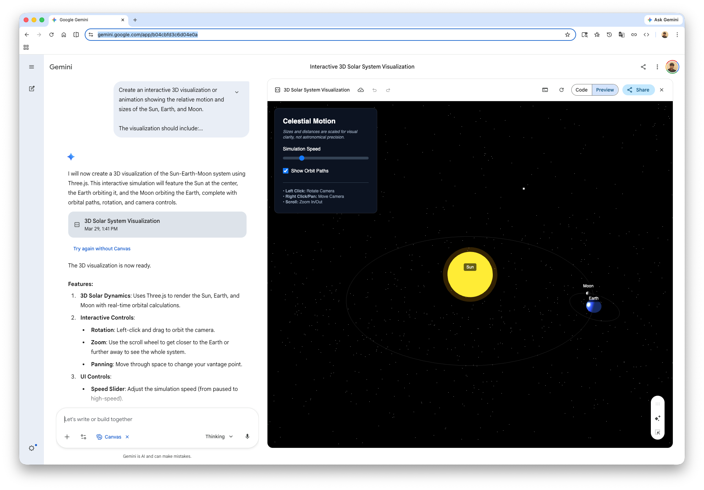
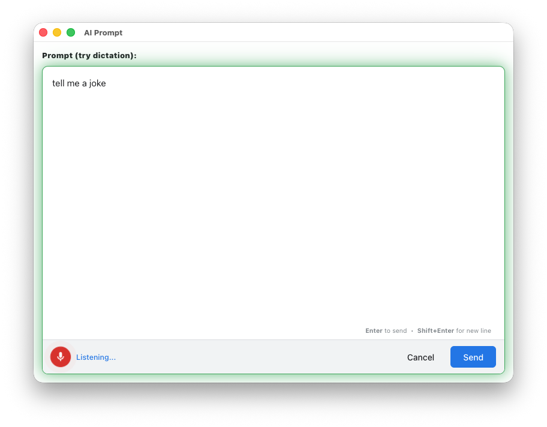
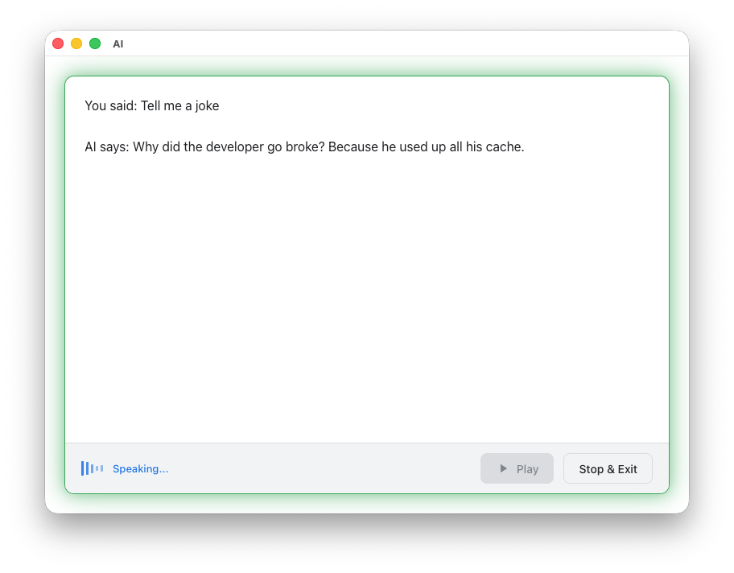

# AI Sidekick

**CAUTION**

**This is an experimental project and is not intended for production use. It registers the `bash` tool which can be used to execute arbitrary commands on your system. Your are prompted before any command is executed. Use it with caution.**

A persistent AI agent that runs as a background process in your terminal, accessible via a simple `ai` shell function. Built on the Google Agent SDK (`@google/adk`), it maintains session context across an interactive shell session and possesses built-in web search capabilities.

## Architecture

The project consists of three core components:

1. **`src/agent.ts`** - The core Node.js agent process. It:
   - Uses `@google/adk` to instantiate a `LlmAgent` and an `InMemoryRunner`.
   - Empowers the LLM with live knowledge using the `GoogleSearchTool`.
   - Equips the LLM with native shell and direct file system awareness via explicitly registered `FunctionTool` extensions (`bash`, `read_file`, `write_file`, `speak`), allowing it to read and author files flawlessly and even speak back to you.
   - **Built-in Security:** Implements a native ADK `SecurityPlugin` with a custom `BasePolicyEngine`. It safely intercepts inherently destructive actions (`bash` execution and `write_file`) and prompts you on your terminal (`Proceed with [tool]([args])? (y/N/(s)ession):`) for explicitly granted authorization before allowing the LLM to modify your machine. You can reply with `s` (session) to automatically allow the action for the remainder of the session without being prompted again.
   - Accumulates multiline prompts from `stdin` until it receives an `__END_OF_PROMPT__` marker.
   - Forwards the prompt to the AI, and natively streams the textual results back to `stdout` in real-time using `StreamingMode.SSE` (Server-Sent Events), terminating with an `__AI_EOF__` marker.
   - Maintains a persistent session (`userId` + `ppid`) across prompts using ADK's `InMemorySessionService` to retain context seamlessly.

2. **`src/chrome-sidekick.ts`** - A shared utility module that:
   - Centralizes Chrome launching and Puppeteer connection logic.
   - Provides consistent browser flags for a clean "App Mode" experience.
   - Manages user data directories and port availability checks.
   - Used by `agent.ts`, `stt.ts`, and `tts.ts`.

3. **`ai_shell_setup.zsh`** - A shell integration script that:
   - Launches the agent as a background process running indefinitely and connected via named pipes (`/tmp/ai_pipe_in.$$`, `/tmp/ai_pipe_out.$$`).
   - Exposes the handy wrapper `ai` shell function for passing shell arguments to the background process and reading the streaming response.
   - **Injects Rich Real-Time Context:** Automatically and safely harvests your environment to make the AI spatially aware with zero overhead.
     - _Fixed Context (Sent Once):_ OS architecture, Username, active Shell, System Time, Editor, and Node.js version.
     - _Dynamic Context (Sent Every Prompt):_ Current Working Directory (`$PWD`), active Python Virtual Environment, Git Repository state (Branch and Clean/Dirty status), and the exit code/text of your most recently executed shell command.
   - Safely cleans up the pipes and kills the background process whenever your shell exits.

4. **`ai_shell_mode_setup.zsh`** - An advanced shell integration that provides all the features of `ai_shell_setup.zsh`, plus a dedicated **AI Modal behavior**:
   - Uses native Zsh Line Editor (ZLE) hooks to intercept shell execution.
   - Allows instantly toggling an "AI Mode" active state via keyboard shortcut (`Ctrl+x Enter`).
   - Visually updates your `RPROMPT` to indicate when AI Mode is active.
   - When AI Mode is active, all input is safely prefixed with a null command (`:`) and sent directly to the background agent.
   - **Temporary Mode Swap:** Press `Alt+Enter` (or `Escape` followed by `Enter`) to submit the current command under the _opposite_ mode. If you are in standard shell mode, `Alt+Enter` sends the command to the AI. If you are in AI Mode, `Alt+Enter` executes the command normally in your local shell.

## Prerequisites

- **Node.js** (capable of executing `.ts` directly, e.g., v22.6+ via `--experimental-strip-types` or native support in v25+)
- **Google Chrome** (used for browser-based GUI dialogs and speech)
- An API key for the corresponding model (e.g. `GOOGLE_API_KEY` or `GEMINI_API_KEY`).

## Setup

1. Install module dependencies:

   ```bash
   npm install
   ```

2. Create a `.env` file specifying your environment mappings and API keys:

   ```bash
   MODEL=gemini-2.5-flash
   GEMINI_API_KEY=<your-google-api-key>
   GOOGLE_GENAI_USE_VERTEXAI=FALSE
   ```

   Alternatively, you can set the `GOOGLE_API_KEY` environment variable.

3. Source the standard shell integration into your active terminal.

   ```bash
   source ./ai_shell_setup.zsh
   ```

   _Alternatively_, if you want the dedicated AI modal behavior, source the mode setup script instead:

   ```bash
   source ./ai_shell_mode_setup.zsh
   ```

## Usage

Once sourced, invoke the `ai` function natively right from your shell. You can ask for information, or ask the agent to act on your local filesystem using its shell and file tools:

```bash
# Query the web models directly
ai "What is today's date and what season it is in USA?"

# Utilize native tool capabilities (bash, file I/O)
ai "Create a new React component called Button in src/components and generate the scaffolding for it"

ai "Find all typescript files in the current directory and read the contents of the largest one"
```

While the agent is thinking, you will see a loading indicator:

```text
⏳
```

Once the agent is done, it will clear the line and you will see the response from the agent.

If your prompt requires visualization it will open a browser window poniting to 'http://gemini.google.com' (you will need to login to Gemini) and have it render the visualization using Canvas tool.



### UI Prompt with dictation (`aiui`)

Use `aiui` to launch a modern GUI prompt dialog. This browser-based window features:

- **Clean Design:** A professional, card-based interface with dark mode support.
- **Dictation Support:** Integrated voice-to-text using the Web Speech API (click the microphone icon).



- **Shortcut Support:** Press `Enter` to send, `Shift+Enter` for a new line, or `Escape` to cancel.
- **Output:** When requested, the AI uses the `speak` tool to read responses back to you.



#### The `speak` Tool

The AI can now "talk" using a high-fidelity browser-based Text-to-Speech (TTS) engine, implemented via `src/tts.ts` and `src/tts_ui.html`.

- **Implementation:** `src/tts.ts` uses `chrome-launcher` and `puppeteer-core` (via `chrome-sidekick.ts`) to launch a dedicated Chrome "App Mode" instance that loads `src/tts_ui.html` and injects the text via the Web Speech API.
- **Visual Feedback:** Shows a large window with the text being spoken and an animated voice visualizer.
- **Modern UI:** Features a pulsating, multi-color techno shadow that glows while the AI is speaking.
- **Automatic Voice Fix:** Includes intelligent initialization logic that automatically nudges the browser's speech engine and performs a one-time auto-reload if voices are missing, ensuring speech starts instantly and reliably.


---

### Advanced: AI Mode (`ai_shell_mode_setup.zsh`)

If you opted to source the `ai_shell_mode_setup.zsh` script, your terminal gains a dedicated **AI Mode**. This is highly recommended for users who want extended conversational interactions with the agent.

1. **Toggle AI Mode:** Press `Ctrl+x Enter` at any time to toggle AI Mode. Your right-side prompt (`RPROMPT`) will automatically update to display a cyan `[AI Mode]` tag.
2. **Conversational Shell:** While AI Mode is active, any text you type into the shell and submit will be routed **directly** to the AI. You do not need to constantly prefix your messages with the `ai` command.
   _(Note: The shell safely intercepts the command by prefixing it with a null bash command `:` so it will never accidentally execute locally)._
3. **Exit AI Mode:** Type `exit`, `quit`, or press `Ctrl+x Enter` again to return your shell to standard bash/zsh execution behavior.
4. **Temporary Mode Swap:** Press `Alt+Enter` (or `Escape` followed by `Enter`) to submit the current command under the _opposite_ mode. If you are in standard shell mode, `Alt+Enter` sends the command to the AI. If you are in AI Mode, `Alt+Enter` executes the command normally in your local shell.

## How It Works

```text
            __END_OF_PROMPT__ ->
                delimeter
┌──────────┐   named pipes  ┌───────────────┐   @google/adk  ┌────────────┐
│  shell   │ ─────────────> │  src/agent.ts │ ─────────────> │  LLM API   │
│   ai()   │ <───────────── │ (with Search) │ <───────────── │   & Web    │
└──────────┘ <- __AI_EOF__  └───────────────┘                └────────────┘
                delimiter
```

1. `ai_shell_setup.zsh` spawns `src/agent.ts` as a persistent background process bound to named pipes upon execution.
2. By triggering `ai "your query"`, your string gets funneled into the agent's `stdin` appendaged by the `__END_OF_PROMPT__` transmission sequence.
3. The node script dispatches the aggregated string payload toward ADK's `InMemoryRunner` engine context.
4. Output sequentially streams back out to your `stdout` and prints into your terminal incrementally—concluding uniformly with the `__AI_EOF__` token.
5. The wrapper loop intercepts the EOF, returning focus cleanly to your bash/zsh prompt.
6. GUI dialogs and voice features are powered by a lightweight Chrome "App Mode" instance controlled via Puppeteer and `src/chrome-sidekick.ts`, ensuring a consistent cross-platform experience.

## License

MIT
